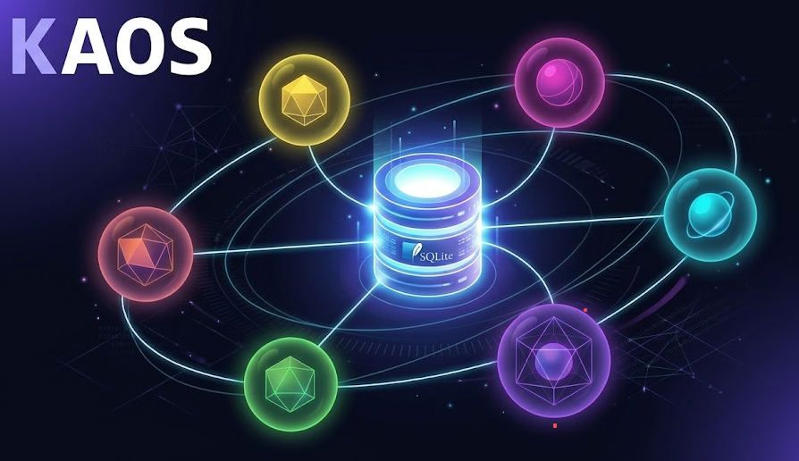
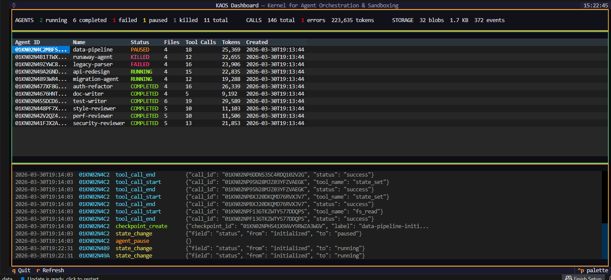
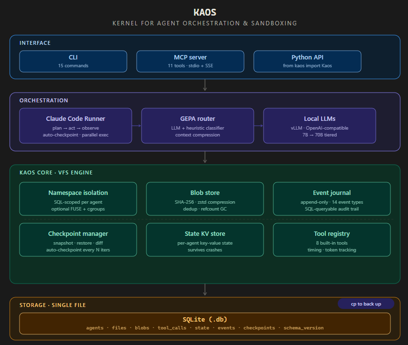

# KAOS

**Kernel for Agent Orchestration & Sandboxing**

> Your agents share filesystems, lose state on crash, and you have no idea what they did. KAOS fixes that. Every agent gets an isolated virtual filesystem inside a single SQLite file — with full history, checkpoint/restore, and SQL-queryable audit trails.



[]()
[]()
[]()
[]()
[]()
[](https://canivel.github.io/kaos/)

---

## The Problem

You're running multiple AI agents. Maybe they're reviewing code, refactoring modules, or writing tests in parallel. Here's what goes wrong:

**Agents step on each other.** Two agents write to the same file. One overwrites the other's work. You don't find out until production.

**An agent goes rogue and you can't debug it.** It made 47 tool calls, modified 12 files, and now the codebase is broken. What did it actually do? In what order? Good luck with `git log`.

**You can't roll back a single agent.** The refactor agent broke everything. You `git reset --hard` and lose the work of the 3 other agents that were fine.

**State vanishes.** Agent crashes mid-task. Its progress, findings, intermediate files — all gone. Start over.

**You can't inspect anything.** How many tokens did each agent use? Which tool calls failed? What files did agent X touch? You're `grep`-ing through logs, if you even have logs.

## How KAOS Solves This

```python
from kaos import Kaos

db = Kaos("project.db")

# Each agent is isolated — they literally cannot see each other's files
agent_a = db.spawn("refactorer")
agent_b = db.spawn("test-writer")

db.write(agent_a, "/src/auth.py", b"# refactored auth module")
db.write(agent_b, "/src/auth.py", b"# test stubs for auth")
# Both wrote to "/src/auth.py" — no conflict. Each has their own copy.

# Checkpoint before risky operations
cp = db.checkpoint(agent_a, label="before-database-migration")
# ... agent does something dangerous ...
db.restore(agent_a, cp)  # roll back just this agent, others untouched

# What exactly did it do? Query the audit trail.
db.query("SELECT event_type, payload FROM events WHERE agent_id = ?", [agent_a])
```

**Everything lives in one `.db` file.** Copy it to back up. Send it to a teammate. Query it with any SQLite client. That's the entire runtime — files, state, tool calls, events, checkpoints.

---

## Why Not Just Use LangChain / CrewAI / AutoGen?

Those frameworks focus on **prompt chaining and agent communication**. KAOS focuses on the **runtime infrastructure** underneath — the part they all skip:

| Problem | LangChain / CrewAI / AutoGen | KAOS |
|---|---|---|
| Agent isolation | Shared filesystem | Enforced per-agent VFS (SQL-scoped) |
| Audit trail | DIY logging | Append-only event journal, every operation |
| Rollback one agent | Not possible | `db.restore(agent, checkpoint)` |
| Debug a failed agent | Read logs, hope for the best | `SELECT * FROM events WHERE agent_id = ?` |
| Portable runtime | Cloud-dependent / in-memory | Single `.db` file, works anywhere |
| State persistence | Framework-specific, often lost on crash | SQLite — survives crashes by design |
| Token/cost tracking | Varies, often manual | `SELECT SUM(token_count) FROM tool_calls` |

KAOS isn't a replacement for those frameworks — it's the **runtime layer they're missing**. You can use KAOS underneath LangChain, or use it standalone with local LLMs.

---

## Quick Start

```bash
git clone https://github.com/canivel/kaos.git && cd kaos
uv sync
kaos setup          # interactive wizard — picks a preset, generates kaos.yaml,
                    # auto-installs MCP server into Claude Code, auto-inits DB
```

### As a Python library (no infrastructure needed)

```python
from kaos import Kaos

db = Kaos("my-project.db")

# Spawn agents with isolated filesystems
researcher = db.spawn("researcher", config={"team": "backend"})
writer = db.spawn("doc-writer", config={"team": "docs"})

# Each agent has its own virtual filesystem
db.write(researcher, "/findings.md", b"# Bug Report\nFound SQL injection in auth.py")
db.write(writer, "/draft.md", b"# API Docs v2\n...")

# Isolation is enforced — not just a convention
db.read(researcher, "/findings.md")   # works
# db.read(writer, "/findings.md")     # FileNotFoundError — isolated!

# KV state per agent (survives crashes)
db.set_state(researcher, "progress", 75)
db.set_state(researcher, "findings", ["SQL injection in auth", "missing rate limit"])

# Checkpoint before risky work
cp1 = db.checkpoint(researcher, label="pre-refactor")
# ... agent does risky stuff ...
cp2 = db.checkpoint(researcher, label="post-refactor")

# Something went wrong? Roll back.
db.restore(researcher, cp1)  # back to safety

# Or diff two checkpoints — what exactly changed?
diff = db.diff_checkpoints(researcher, cp1, cp2)
# → files added/removed/modified, state changes, tool calls between checkpoints

# Query anything with SQL
db.query("SELECT name, status FROM agents")
db.query("SELECT SUM(token_count) FROM tool_calls WHERE agent_id = ?", [researcher])

db.close()
```

### With local LLMs (fully autonomous agents)

Point KAOS at local vLLM instances — including your own finetuned models:

```bash
# Start your models (any OpenAI-compatible endpoint)
vllm serve Qwen/Qwen2.5-Coder-7B-Instruct --port 8000
vllm serve deepseek-ai/DeepSeek-R1-70B --port 8002
```

```python
import asyncio
from kaos import Kaos
from kaos.ccr import ClaudeCodeRunner
from kaos.router import GEPARouter

db = Kaos("project.db")
router = GEPARouter.from_config("kaos.yaml")
ccr = ClaudeCodeRunner(db, router)

# GEPA router auto-classifies task complexity and picks the right model:
#   trivial → 7B (fast, cheap)    complex → 70B (powerful)
results = asyncio.run(ccr.run_parallel([
    {"name": "tests",  "prompt": "Write unit tests for the payments module"},
    {"name": "impl",   "prompt": "Refactor payments to use Stripe SDK v3"},
    {"name": "docs",   "prompt": "Update the payment API documentation"},
]))

# Every agent ran in parallel, fully isolated, with auto-checkpointing.
# Query what happened:
stats = db.query("""
    SELECT a.name,
           COUNT(tc.call_id) as tool_calls,
           SUM(tc.token_count) as tokens
    FROM agents a LEFT JOIN tool_calls tc ON a.agent_id = tc.agent_id
    GROUP BY a.agent_id
""")
```

### As an MCP Server (Claude Code integration)

```bash
kaos serve --transport stdio
```

Add to `~/.claude/settings.json`:
```json
{
  "mcpServers": {
    "kaos": {
      "command": "kaos",
      "args": ["serve", "--transport", "stdio"]
    }
  }
}
```

Now Claude Code can spawn agents, read/write to their filesystems, create checkpoints, and query the database — all as native tool calls.

### Via the CLI

```bash
kaos setup                             # Interactive setup wizard (6 presets)
kaos init                              # Create database
kaos run "refactor auth module" -n auth # Run a single agent
kaos parallel \
    -t tests "write tests" \
    -t impl "refactor code" \
    -t docs "update docs"              # Run agents in parallel
kaos ls                                # List agents
kaos status <agent-id>                 # Agent details
kaos read <agent-id> /path/to/file     # Read VFS files
kaos logs <agent-id>                   # View conversation + event log
kaos logs <agent-id> --tail 20         # Last 20 events
kaos checkpoint <agent-id> -l "safe"   # Snapshot agent state
kaos restore <agent-id> --checkpoint X # Roll back
kaos diff <agent-id> --from X --to Y   # What changed between checkpoints?
kaos query "SELECT * FROM events"      # SQL queries
kaos dashboard                         # Live TUI monitor
kaos search "TF-IDF retrieval"         # Full-text search across all agents
kaos index <agent-id>                  # Build /index.md for agent VFS
kaos mh search -b text_classify -n 10 --background  # Background worker
kaos mh search -b text_classify --dry-run            # Seeds only, no proposer
kaos mh status <search-agent-id>       # Poll search progress
kaos mh lint <search-agent-id>         # Health-check search archive
kaos mh knowledge                      # View persistent knowledge base
kaos mh resume <search-agent-id>       # Resume interrupted search
kaos export <agent-id> -o backup.db    # Export a single agent

# JSON output — composable with any agent framework
kaos --json ls                         # Structured JSON to stdout
kaos --json search "keyword"           # Search results as JSON
kaos --json mh knowledge | jq .benchmarks
```

### Live Dashboard

Monitor all agents in real time — status, files, tool calls, token usage, and a streaming event log. The dashboard includes a dedicated **Meta-Harness panel** (purple border) showing active searches with status, current iteration, harness count, and frontier size — auto-refreshes every 5 seconds.

```bash
kaos dashboard
```



---

## Key Capabilities

### Enforced Agent Isolation

Not convention-based. Every VFS operation is SQL-scoped with `WHERE agent_id = ?`. It's physically impossible for one agent to access another's files through the API. Optional FUSE tier (Linux) adds OS-level mount + namespace isolation with cgroup resource limits.

### Append-Only Audit Trail

Every operation is recorded: file reads, writes, deletes, tool calls (with timing and token counts), state changes, lifecycle events. 14 event types total. Query any agent's complete history with SQL.

```sql
-- What did this agent do in the last hour?
SELECT timestamp, event_type, payload FROM events
WHERE agent_id = 'auth-refactor'
  AND timestamp > datetime('now', '-1 hour')
ORDER BY timestamp;
```

### Checkpoint / Restore / Diff

Snapshot an agent's files + state at any point. Restore to any checkpoint. Diff two checkpoints to see exactly what changed — files added/removed/modified, state changes, and tool calls between them. Auto-checkpoints every N iterations as a safety net.

```python
cp1 = db.checkpoint(agent, label="before-migration")
# ... agent works ...
cp2 = db.checkpoint(agent, label="after-migration")

diff = db.diff_checkpoints(agent, cp1, cp2)
# diff.files.added, diff.files.modified, diff.state.changed, diff.tool_calls
```

### Content-Addressable Blob Store

Files are stored as SHA-256 blobs with zstd compression. Identical files across agents are deduplicated automatically. Reference counting with garbage collection keeps storage lean — even with hundreds of agents.

### Intelligent Model Routing (GEPA)

The **G**eneralized **E**xecution **P**lanning & **A**llocation router classifies task complexity (via LLM or heuristic fallback) and routes to the optimal model tier. Trivial formatting task? Send it to a local 7B. Complex architecture decision? Route to Claude or GPT-4o. Works across all three providers (local, OpenAI, Anthropic) and any OpenAI-compatible endpoint.

### Single-File Portability

The entire runtime is one `.db` file. Back it up with `cp`. Send it to a colleague. Open it on another machine. Query it with DBeaver, DataGrip, or the `sqlite3` CLI. No cloud, no server, no Docker.

---

## Real-World Examples

### Code Review Swarm

Four agents review the same code from different angles — security, performance, style, and test coverage — all running in parallel with full isolation:

```python
# examples/code_review_swarm.py
results = await ccr.run_parallel([
    {"name": "security",    "prompt": f"Find security vulnerabilities:\n{code}",
     "config": {"force_model": "deepseek-r1-70b"}},
    {"name": "performance", "prompt": f"Find performance issues:\n{code}"},
    {"name": "style",       "prompt": f"Review style and best practices:\n{code}"},
    {"name": "test-gaps",   "prompt": f"What test cases are missing?\n{code}"},
])
# Each agent's findings are in its own VFS — combine, compare, or query with SQL.
```

### Self-Healing Agent

Checkpoint before risky operations, automatically restore on failure:

```python
# examples/self_healing_agent.py
cp = db.checkpoint(agent, label="pre-migration")
try:
    result = await ccr.run_agent(agent, "Migrate the database schema to v3")
except Exception:
    db.restore(agent, cp)  # roll back just this agent
    # other agents keep running, unaffected
```

### Autonomous Research Lab (autoresearch pattern)

Inspired by [Karpathy's autoresearch](https://github.com/karpathy/autoresearch): run N research agents in parallel, each exploring a different ML hypothesis — architecture, optimizer, scaling, regularization — all isolated and SQL-queryable:

```python
# examples/autonomous_research_lab.py
# Each agent gets its own isolated copy of train.py
for direction in ["architecture", "optimizer", "scaling", "regularization"]:
    agent = db.spawn(f"{direction}-explorer")
    db.write(agent, "/train.py", BASE_TRAIN_PY.encode())
    db.checkpoint(agent, label="baseline")

# Run all 4 in parallel — modify train.py, run experiments, keep/discard
results = await ccr.run_parallel(RESEARCH_DIRECTIONS)

# Query results across ALL agents with SQL
db.query("""
    SELECT a.name, COUNT(tc.call_id) as experiments, SUM(tc.token_count) as tokens
    FROM agents a JOIN tool_calls tc ON a.agent_id = tc.agent_id
    GROUP BY a.agent_id ORDER BY tokens DESC
""")
```

autoresearch uses git commit/reset — KAOS uses formal checkpoints with diff. autoresearch tracks results in a TSV — KAOS gives you SQL. autoresearch is 1 agent — KAOS runs N in parallel, isolated.

**Multi-GPU orchestration** is also supported: run 6 agents across 3 GPUs, each assigned to a model tier via GEPA `force_model`. For example, GPU 0 runs a 7B for sweeps, GPU 1 a 32B for architecture exploration, and GPU 2 a 70B for novel research. See `examples/multi_gpu_research.py` for the full setup. [Full tutorial](docs/tutorial-autoresearch.md)

### Post-Mortem Debugging

An agent broke something. Figure out exactly what happened:

```python
# examples/post_mortem.py
# What files did it touch?
db.query("SELECT path, version FROM files WHERE agent_id = ?", [agent_id])

# What tool calls failed?
db.query("""
    SELECT tool_name, error, duration_ms
    FROM tool_calls
    WHERE agent_id = ? AND status = 'error'
    ORDER BY timestamp
""", [agent_id])

# Full event timeline
db.query("""
    SELECT timestamp, event_type, payload FROM events
    WHERE agent_id = ? ORDER BY timestamp
""", [agent_id])

# How much did it cost?
db.query("SELECT SUM(token_count) FROM tool_calls WHERE agent_id = ?", [agent_id])
```

### Export & Share Agent State

```python
# examples/export_share.py
# Export a single agent's complete state to a standalone file
# kaos export <agent-id> -o agent-snapshot.db

# Send to teammate, they import it:
# kaos import agent-snapshot.db

# Or just copy the whole database:
# cp kaos.db full-backup.db
```

### Optimize a Support Ticket Classifier (Meta-Harness)

Your LLM classifies support tickets at 45% accuracy. Meta-Harness automatically searches for a better prompt/retrieval strategy by learning from full execution traces:

```python
# examples/meta_harness_support_tickets.py
from kaos import Kaos
from kaos.metaharness import SearchConfig
from kaos.metaharness.search import MetaHarnessSearch

db = Kaos("search.db")
router = GEPARouter.from_config("kaos.yaml")

# Define your benchmark with your data + 3 seed harnesses
bench = SupportTicketBenchmark()

# Run the search — KAOS stores every harness, score, and trace
search = MetaHarnessSearch(db, router, bench, SearchConfig(
    benchmark="support_tickets",
    max_iterations=10,
    candidates_per_iteration=2,
))
result = await search.run()

# result.frontier has the Pareto-optimal harnesses (best accuracy vs. cost)
# The whole search is one .db file — inspect, query, or share it
```

What happens inside: seed harnesses are evaluated, then a proposer agent reads ALL prior code + scores + execution traces, identifies failure modes, and proposes better harnesses. After 10 iterations, accuracy goes from 45% to 87%. [Full walkthrough](docs/meta-harness.md)

### Find the Best Math Retrieval Strategy (Meta-Harness)

You have a corpus of 500K solved math problems. Which ones should you retrieve to help solve a new problem? Meta-Harness finds out:

```python
# examples/meta_harness_math.py
bench = get_benchmark("math_rag",
    problems_path="olympiad_problems.jsonl",
    corpus_path="solved_problems.jsonl",
)
search = MetaHarnessSearch(db, router, bench, SearchConfig(
    benchmark="math_rag",
    max_iterations=15,
    candidates_per_iteration=2,
))
result = await search.run()

# The discovered harness might use domain-aware routing:
#   geometry → fetch from NuminaMath, combinatorics → fetch from OpenMathReasoning
# You'd never design this by hand — the proposer found it from the traces
```

### Optimize an Agentic Coding Harness (Meta-Harness)

Your coding agent solves 60% of tasks. Meta-Harness discovers that gathering an environment snapshot first eliminates 2-4 wasted turns:

```python
# examples/meta_harness_coding.py
bench = get_benchmark("agentic_coding",
    tasks_path="coding_tasks.jsonl",
)
search = MetaHarnessSearch(db, router, bench, SearchConfig(
    benchmark="agentic_coding",
    max_iterations=10,
    candidates_per_iteration=2,
    objectives=["+pass_rate"],
))
result = await search.run()
```

### Predict Customer Lifetime Value (Meta-Harness)

Your CLV model gets 40% of predictions within 20% of actual value. Meta-Harness finds the best framing: segment-aware prompting, churn-first reasoning, recency-weighted examples:

```python
# examples/meta_harness_clv_prediction.py
bench = CLVBenchmark()  # Your customer data
search = MetaHarnessSearch(db, router, bench, SearchConfig(
    benchmark="clv_prediction",
    max_iterations=8,
    candidates_per_iteration=2,
    objectives=["+accuracy", "-context_cost"],
))
result = await search.run()
# Discovered: two-step harness (predict churn → then CLV) beats single-step by 25 points
```

### Optimize CRM Campaign Messages (Meta-Harness)

Your email campaigns get 12% open rate. Meta-Harness learns which tone, CTA style, and customer data to include per segment:

```python
# examples/meta_harness_crm_campaigns.py
bench = CRMCampaignBenchmark()  # Your campaign history
search = MetaHarnessSearch(db, router, bench, SearchConfig(
    benchmark="crm_campaigns",
    max_iterations=8,
    objectives=["+relevance", "-context_cost"],
))
result = await search.run()
# Discovered: enterprise wants ROI language, consumers want urgency — different harness per segment
```

### Optimize Fraud Detection (Meta-Harness)

Your fraud classifier has 65% recall with 30% false positives. Meta-Harness finds a red-flag checklist + contrastive examples approach that improves F1 by 20 points:

```python
# examples/meta_harness_fraud_detection.py
bench = FraudDetectionBenchmark()  # Your transaction data
search = MetaHarnessSearch(db, router, bench, SearchConfig(
    benchmark="fraud_detection",
    max_iterations=8,
    objectives=["+f1_score", "-context_cost"],
))
result = await search.run()
# Pareto frontier: [high recall, more tokens] ↔ [balanced F1, fewer tokens]
```

---

## Meta-Harness: How It Works

> Based on [Meta-Harness (arXiv:2603.28052)](https://yoonholee.com/meta-harness/) — your LLM is only as good as the code wrapping it.

The **harness** is the code wrapping your LLM — the prompt template, example selection, retrieval strategy, memory management. Changing it produces a **6x performance gap** on the same model. But harnesses are designed by hand.

Meta-Harness automates the search. Here's the loop:

```
 Iteration 0: Evaluate seed harnesses (zero-shot, few-shot, retrieval)
              Store source + scores + full execution traces in KAOS archive
                                    │
 Iteration 1: Proposer agent reads ─┘ ALL prior code, scores, AND traces
              Notices: "retrieval fails on unusual wording"
              Proposes: two-stage verification harness
              Evaluate → accuracy jumps from 70% to 80%
                                    │
 Iteration 2: Proposer reads ───────┘ new traces + all prior
              Notices: "verification fails on ambiguous tickets"
              Proposes: contrastive examples + cheap variant
              Pareto frontier: [best accuracy] [cheapest] [balanced]
                                    │
 Iterations 3-N: Each iteration ────┘ has full history
              Proposer learns what works, what regresses, and why
              Makes targeted fixes, not rewrites
```

**The critical insight** (from the paper's ablation): giving the proposer access to raw execution traces — not summaries, not just scores — improves the final result by 15+ points. KAOS stores these traces as JSONL files in each harness agent's VFS, with richer fields than vanilla Meta-Harness: input preview, expected answer, prompt preview, prediction, correct boolean, and context token count per problem. Per-problem results are also stored separately in `per_problem.jsonl` for detailed analysis.

**Paper-aligned improvements:** The proposer prompt enforces additive changes after regressions, isolates variables (one change per harness), and cross-references iterations. Harness candidates go through **two-stage validation** (AST check for a top-level `run()` function + smoke test) before evaluation. The proposer also has a `mh_grep_archive` tool to search across all files in the archive, making it easy to find which harnesses use a specific technique or which traces contain a failure mode.

**Smart Context Compaction (v0.4.0):** The proposer needs to read all prior harnesses, scores, and traces before proposing improvements. Without compaction, this means 5-10 tool calls per iteration, each replaying the full conversation — causing timeouts with subprocess-based providers. KAOS now pre-builds a structured **archive digest** that extracts error patterns, keeps scores and source code losslessly, and drops noise (correct-problem traces, verbose per-problem details). The proposer reads one digest instead of making 10 tool calls.

```
Compaction Results (6 diagnostic questions, all levels):
Level  0 │ 5292 chars ( 22% saved) │ quality=100% │ 6/6 questions answerable
Level  5 │ 3672 chars ( 46% saved) │ quality=100% │ 6/6 questions answerable ← default
Level 10 │ 2512 chars ( 63% saved) │ quality=100% │ 6/6 questions answerable
```

Zero quality loss at any level — structured extraction is actually *better* than raw data because it surfaces patterns explicitly. Configure with `compaction_level` (0-10) in `SearchConfig` or `kaos.yaml`.

**Why KAOS?** Each harness runs in its own isolated VFS. The search is checkpointed every iteration. Every proposer read, every evaluation, every trace is in the SQL-queryable audit trail. The entire search is one portable `.db` file. Knowledge compounds across searches via the persistent knowledge agent.

```bash
# Run a search
kaos mh search -b text_classify -n 10 -k 2

# Run with paper benchmarks (downloaded from HuggingFace, cached locally)
kaos mh search -b lawbench -n 20 -k 3
kaos mh search -b symptom2disease -n 20 -k 3
kaos mh search -b uspto_50k -n 20 -k 3

# View the Pareto frontier
kaos mh frontier <search-agent-id>

# Inspect the winning harness (source + scores + traces)
kaos mh inspect <search-agent-id> <harness-id>

# Resume an interrupted search from its last completed iteration
kaos mh resume <search-agent-id>

# Query the search with SQL
kaos query "SELECT SUM(token_count) FROM tool_calls"
```

**[Full docs and walkthrough](docs/meta-harness.md)** | **[Example: Support ticket classifier](examples/meta_harness_support_tickets.py)** | **[Original paper & code](https://github.com/stanford-iris-lab/meta-harness-tbench2-artifact)**

---

## Architecture



Five layers, one SQLite file:
- **Interfaces** — CLI (25+ commands, `--json` output), MCP Server (18 tools), Python SDK, TUI Dashboard
- **Orchestration** — CCR agent loop, GEPA model router, 4 providers (local/OpenAI/Anthropic/Claude Code)
- **Meta-Harness** — Search loop, detached worker process, proposer agent, evaluator, Pareto frontier
- **KAOS Core** — Namespace isolation, blob store, event journal, checkpoints, state KV, tool registry with permissions, context compaction
- **Storage** — Single SQLite `.db` file: agents, files, blobs, tool_calls, state, events, checkpoints


## Setup & Configuration

### `kaos setup` — Interactive Wizard

The fastest way to get started. Run `kaos setup` and answer 3 questions — it generates a `kaos.yaml` tailored to your environment, auto-installs the MCP server into Claude Code settings (project or global), and auto-initializes the database.

```bash
kaos setup
```

**6 presets:**

| Preset | What it configures |
|---|---|
| `claude-code` | Anthropic Claude via API, optimized for Claude Code MCP integration |
| `local` | Single local vLLM/ollama/llama.cpp endpoint (default, backward compatible) |
| `local-multi` | Multiple local models on different ports, GEPA routing by complexity |
| `anthropic` | Anthropic Claude API only (requires `ANTHROPIC_API_KEY`) |
| `openai` | OpenAI API only (requires `OPENAI_API_KEY`) |
| `hybrid` | Mix of local + cloud models, route trivial tasks locally and complex tasks to cloud |

### Multi-Provider Support

KAOS supports five providers:

- **`provider: agent_sdk`** — Claude Agent SDK. No subprocess, no rate limit competition. Works during active Claude Code sessions. *Recommended.*
- **`provider: claude_code`** — Claude Code CLI subprocess (`claude --print`). Only works when session is idle.
- **`provider: anthropic`** — Direct Anthropic API via raw httpx. Needs `ANTHROPIC_API_KEY`. Independent quota.
- **`provider: openai`** — Any OpenAI-compatible cloud endpoint. Needs API key.
- **`provider: local`** — vLLM, ollama, llama.cpp. Zero cost, needs GPU.

`agent_sdk` and `claude_code` use your Claude Code subscription (no API key). `anthropic` and `openai` need API keys via environment variables.

### Configuration

```yaml
# kaos.yaml — multi-provider example (hybrid preset)
database:
  path: ./kaos.db
  wal_mode: true
  compression: zstd

models:
  claude-sonnet:
    provider: anthropic
    model_id: claude-sonnet-4-20250514
    api_key_env: ANTHROPIC_API_KEY
    max_context: 200000
    use_for: [complex, critical]
  gpt-4o:
    provider: openai
    model_id: gpt-4o
    api_key_env: OPENAI_API_KEY
    max_context: 128000
    use_for: [moderate]
  local-qwen:
    provider: local
    endpoint: http://localhost:8000/v1
    max_context: 32768
    use_for: [trivial]

router:
  classifier_model: local-qwen
  fallback_model: claude-sonnet
  context_compression: true
  max_retries: 1             # fail fast — retries handled at search level

ccr:
  max_iterations: 100
  checkpoint_interval: 10
  max_parallel_agents: 8

search:
  compaction_level: 5        # 0 (no compaction) to 10 (maximum), default 5
  proposer_timeout: 900      # seconds per proposer iteration
```

The `provider: local` format is backward compatible with the existing `vllm_endpoint` syntax — existing configs continue to work without changes.

<details>
<summary>Local-only config (same as before)</summary>

```yaml
# kaos.yaml — local-only (backward compatible)
database:
  path: ./kaos.db
  wal_mode: true
  compression: zstd

models:
  qwen2.5-coder-7b:
    vllm_endpoint: http://localhost:8000/v1
    max_context: 32768
    use_for: [trivial, code_completion]
  qwen2.5-coder-32b:
    vllm_endpoint: http://localhost:8001/v1
    max_context: 131072
    use_for: [moderate, code_generation]
  deepseek-r1-70b:
    vllm_endpoint: http://localhost:8002/v1
    max_context: 131072
    use_for: [complex, critical, planning]

router:
  classifier_model: qwen2.5-coder-7b
  fallback_model: deepseek-r1-70b
  context_compression: true

ccr:
  max_iterations: 100
  checkpoint_interval: 10
  max_parallel_agents: 8
```

</details>

## Project Structure

```
kaos/
├── core.py                  # Kaos VFS engine
├── schema.py                # SQLite schema (8 tables)
├── blobs.py                 # Content-addressable blob store (SHA-256 + zstd)
├── events.py                # Append-only event journal (14 event types)
├── checkpoints.py           # Checkpoint / restore / diff
├── isolation.py             # Logical isolation + optional FUSE tier
├── ccr/
│   ├── runner.py            # Agent execution loop (plan → act → observe)
│   └── tools.py             # Tool registry (8 built-in tools)
├── router/
│   ├── gepa.py              # Intelligent model routing
│   ├── classifier.py        # LLM + heuristic complexity classifier
│   ├── context.py           # Multi-stage context compression
│   ├── vllm_client.py       # Raw httpx client for local endpoints
│   ├── openai_client.py     # Raw httpx client for OpenAI API
│   └── anthropic_client.py  # Raw httpx client for Anthropic API
├── metaharness/
│   ├── search.py            # Meta-Harness search loop (Algorithm 1)
│   ├── worker.py            # Detached worker subprocess for background search
│   ├── proposer.py          # Proposer agent with archive tools (incl. mh_grep_archive)
│   ├── evaluator.py         # Harness evaluation with trace capture
│   ├── harness.py           # HarnessCandidate + EvaluationResult
│   ├── pareto.py            # Pareto frontier computation
│   └── benchmarks/          # text_classify, math_rag, agentic_coding, paper_datasets
├── mcp/
│   └── server.py            # MCP server (18 tools, stdio + SSE)
└── cli/
    ├── main.py              # 25+ CLI commands (read, logs, --json, --dry-run)
    └── dashboard.py         # Live TUI dashboard (Textual)
```

## Zero Bloat

KAOS has **no AI SDK dependencies**. No `openai`. No `litellm`. No `langchain`. All three providers (local, OpenAI, Anthropic) use raw httpx. Just 44 packages total:

| Package | Why |
|---|---|
| `httpx` | Raw HTTP to local, OpenAI, and Anthropic endpoints |
| `click` | CLI |
| `rich` + `textual` | Terminal UI + dashboard |
| `mcp` | MCP server protocol |
| `pyyaml` | Config |
| `zstandard` | Blob compression |
| `ulid-py` | Time-sortable unique IDs |

---

## Tutorials & Docs

- **[Run a Free Local Multi-Agent System](docs/tutorial-local-agents.md)** — End-to-end guide: vLLM + KAOS + Claude Code, from zero to running parallel agents on your own GPU at zero cost.
- **[Meta-Harness: Automated Harness Optimization](docs/meta-harness.md)** — How to automatically find the best prompt/retrieval strategy for your LLM, with full walkthrough.
- **[Autonomous Research Lab](docs/tutorial-autoresearch.md)** — Run N research agents in parallel, each exploring a different ML hypothesis. Inspired by [Karpathy's autoresearch](https://github.com/karpathy/autoresearch).
- [MCP Server Integration](docs/mcp-integration.md) — Full reference for all 18 MCP tools.
- [Architecture](docs/architecture.md) — System design deep dive.
- [Database Schema](docs/schema.md) — All 8 tables documented.

## What's New in v0.4.2

### Claude Agent SDK Provider
New `provider: agent_sdk` uses the Claude Agent SDK directly — no subprocess, no conversation replay, no rate limit competition with active Claude Code sessions. Seeds scored **90.6% accuracy** vs 0% with the `claude_code` provider in the same session.

```yaml
models:
  claude-sonnet:
    provider: agent_sdk          # uses Claude Agent SDK
    model_id: claude-sonnet-4-6
    timeout: 120
```

### 5 Providers — Pick What Works
- **`agent_sdk`** — shares session auth, works during active sessions (recommended)
- **`claude_code`** — `claude --print` subprocess, works when session is idle
- **`anthropic`** — direct API via httpx, needs API key, independent quota
- **`openai`** — any OpenAI-compatible endpoint
- **`local`** — vLLM/ollama/llama.cpp, zero cost

### Other v0.4.x Highlights
- Cross-search memory, full-text search, VFS index, lint, persistent skills
- Smart compaction (78% fewer tokens, 100% quality at default)
- Single-shot proposer, text extraction fallback, 120s default timeout

### v0.3.x Highlights
- `--json` on all commands, worker subprocess, `provider: claude_code`
- `kaos read`, `kaos logs`, `kaos mh search --dry-run`
- Bug fixes: Unicode crash, WAL contention, output truncation, stdout corruption

### Upgrading

```bash
git pull origin main
uv sync
kaos --version  # 0.4.1
```

If you have the MCP server running (via Claude Code or `kaos serve`), restart it so it picks up the new code:

```bash
# Option 1: Claude Code restarts the MCP server automatically on next tool call
# after you close and reopen the session.

# Option 2: If running standalone, kill and restart:
kaos serve --transport stdio
```

Any running background workers (`kaos mh search --background`) will continue using the old version until they finish. New workers will use the updated code.

Existing `kaos.yaml` configs and `kaos.db` databases work unchanged across versions. See [CHANGELOG.md](CHANGELOG.md) for full details.

<details>
<summary>v0.2.0 changes (Meta-Harness & Multi-Provider)</summary>

- Paper-aligned Meta-Harness (arXiv:2603.28052) with 7 improvements
- `kaos setup` interactive wizard (6 presets)
- Multi-provider support: `local`, `openai`, `anthropic` (all raw httpx)
- 18 MCP tools, resume interrupted searches, dashboard Meta-Harness panel
- Paper benchmark loaders (LawBench, Symptom2Disease, USPTO-50k)
- Multi-GPU autoresearch orchestration
</details>

## License

Apache 2.0

## Author

**Danilo Canivel**

---

*Built because agents deserve better infrastructure than "just use a temp directory."*
