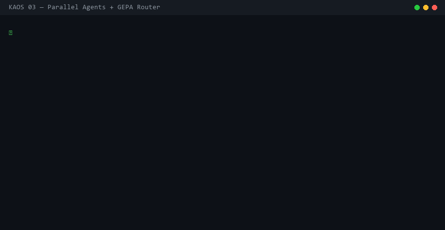

# KAOS

**The living synthesis of agentic AI research.** Six research breakthroughs — memory that learns, coordination that requires consensus, context that compresses without loss, agents that co-evolve, failures diagnosed automatically, strategies optimized continuously — unified in one framework. Safe, reliable, and production-grade by default. Self-improving by design.

[]()
[]()
[]()
[]()

> KAOS doesn't build from scratch — it identifies the best solution to each hard problem in agentic AI and integrates it faithfully. Every capability traces back to a proven paper or open-source project. We add new integrations as we find synergy and reason to include them.



---

## Install

```bash
git clone https://github.com/canivel/kaos.git && cd kaos
uv sync
kaos setup
```

> Need `uv`? → `curl -LsSf https://astral.sh/uv/install.sh | sh`

**Try the demo instantly (no API keys needed):**

```bash
kaos demo
```

Opens a live dashboard with 3 example execution waves so you can see what KAOS looks like before writing any code.

---

## Use with Claude Code / Cursor / any AI coding tool

After `kaos setup`, KAOS registers itself as an MCP server. Then just ask your AI assistant:

```
with kaos, review my payments module — run a security agent and a test-writing agent in parallel
```

```
with kaos, refactor auth.py — three agents in parallel: implement, test, and document
```

```
with kaos, why did the last run fail? show me the agent that errored and its tool calls
```

KAOS handles isolation, checkpointing, and the dashboard automatically.

---

## What it does

Each capability in KAOS comes from a proven source. Nothing is invented that doesn't need to be.

| Problem | Best-in-class solution | Source | Since |
|---|---|---|---|
| Agents reinvent solutions | Cross-agent skill library — parameterized templates, usage tracking | [arXiv:2604.08224](https://arxiv.org/abs/2604.08224) | **v0.7.0 🆕** |
| Agents repeat past mistakes | FTS5 cross-agent memory with BM25 search | [claude-mem](https://github.com/thedotmack/claude-mem) | v0.6.0 |
| Agents act without consensus | SharedLog: intent → vote → decide | [LogAct arXiv:2604.07988](https://arxiv.org/abs/2604.07988) | v0.6.0 |
| Agents co-evolve poorly | Stagnation detection + skill sharing | [CORAL arXiv:2604.01658](https://arxiv.org/abs/2604.01658) | v0.6.0 |
| Failures are opaque | Surrogate Verifier — isolated failure diagnostics | [EvoSkills arXiv:2604.01687](https://arxiv.org/abs/2604.01687) | v0.5.1 |
| Context explodes, quality drops | AAAK compact notation, 57% savings at default | [MemPalace](https://github.com/milla-jovovich/mempalace) | v0.5.2 |
| Strategies don't improve | Evolutionary proposer reads execution traces | [Meta-Harness arXiv:2603.28052](https://arxiv.org/abs/2603.28052) | v0.2.0 |
| Agent isolation is convention | Enforced per-agent VFS + audit trail | KAOS core | v0.1.0 |
| Agent crashes lose progress | Checkpoint / restore / diff | KAOS core | v0.1.0 |

---

## Run agents

**CLI:**
```bash
kaos run "refactor auth.py" -n auth-agent        # single agent
kaos parallel \
  -t security "find vulnerabilities" \
  -t tests    "write unit tests" \
  -t docs     "update API docs"                   # parallel agents
```

**Python:**
```python
from kaos import Kaos
from kaos.ccr import ClaudeCodeRunner
from kaos.router import GEPARouter

db     = Kaos("project.db")
ccr    = ClaudeCodeRunner(db, GEPARouter.from_config("kaos.yaml"))

results = asyncio.run(ccr.run_parallel([
    {"name": "security", "prompt": "Find vulnerabilities in auth.py"},
    {"name": "tests",    "prompt": "Write unit tests for auth.py"},
]))
```

---

## Inspect & debug

```bash
kaos ls                            # list all agents + status
kaos logs <id>                     # conversation + event log
kaos read <id> /path/to/file       # read a file from the agent's VFS
kaos checkpoint <id> -l "safe"     # snapshot agent state
kaos restore <id> --checkpoint X   # roll back to that snapshot
kaos diff <id> --from X --to Y     # what changed between checkpoints?
kaos query "SELECT * FROM events"  # raw SQL on everything
kaos ui                            # open the web dashboard
```

---

## Dashboard

```bash
kaos ui        # web dashboard — Gantt timeline, live events, agent inspector
kaos dashboard # terminal TUI
kaos demo      # demo data + open dashboard
```

The web dashboard shows each execution wave as a **Gantt timeline**: one horizontal bar per agent, colored by status (green = done, purple = running, red = failed). Click any bar to inspect tool calls, files, checkpoints, and events.

---

## Python library

```python
from kaos import Kaos

db = Kaos("project.db")

# Each agent has its own isolated filesystem
a = db.spawn("refactorer")
b = db.spawn("test-writer")
db.write(a, "/src/auth.py", b"# refactored")
db.write(b, "/src/auth.py", b"# tests")  # no conflict — separate VFS

# Checkpoint / restore
cp = db.checkpoint(a, label="before-migration")
# ... agent does work ...
db.restore(a, cp)  # roll back just this agent

# Query everything with SQL
db.query("SELECT name, status FROM agents")
db.query("SELECT SUM(token_count) FROM tool_calls WHERE agent_id = ?", [a])
```

---

## Documentation

| | |
|---|---|
| [Philosophy](docs/philosophy.md) | Why KAOS synthesizes research, integration criteria, what's next |
| [Dashboard](docs/dashboard.md) | Gantt timeline, agent inspector, live events |
| [Use Cases](docs/use-cases.md) | Code review swarm, parallel refactor, incident response, ML research, and more |
| [Checkpoints](docs/checkpoints.md) | Snapshot, restore, diff — with examples |
| [CLI Reference](docs/cli-reference.md) | Every command and flag |
| [MCP Integration](docs/mcp-integration.md) | Claude Code / Cursor setup, all 25 tools |
| [Meta-Harness](docs/meta-harness.md) | Automated prompt/strategy optimization |
| [Cross-Agent Memory](docs/memory.md) | FTS5 searchable memory across agents and sessions |
| [Skill Library](docs/skills.md) | FTS5 cross-agent procedural skill templates with usage tracking |
| [Shared Log](docs/shared-log.md) | LogAct intent/vote/decide coordination protocol |
| [Architecture](docs/architecture.md) | Internals, subsystem design |
| [Schema](docs/schema.md) | All 10 SQLite tables |
| [Deployment](docs/deployment.md) | vLLM, production config |

Full docs index → [`docs/`](docs/)

---

## Examples

See [`examples/`](examples/) for:
- `code_review_swarm.py` — 4 agents review code in parallel
- `parallel_refactor.py` — implement + test + document simultaneously
- `self_healing_agent.py` — auto-restore on failure
- `autonomous_research_lab.py` — N hypothesis agents, SQL result comparison
- `meta_harness_*.py` — automated prompt/strategy optimization
- `memory_search.py` — cross-agent FTS5 memory write and search
- `shared_log_coordination.py` — LogAct 4-stage coordination walkthrough
- `safety_voting.py` — human-in-the-loop safety gate with voting

---

## How agents are isolated

Each agent's files, state, tool calls, and events are stored in separate rows scoped by `agent_id`. There is no shared filesystem — it's enforced at the query level, not by convention. The entire runtime is one `.db` file you can copy, share, or open in any SQLite client.

---

## Credits

KAOS builds on ideas from several open-source projects and research papers:

**Cross-Agent Memory** (`kaos/memory.py`, `kaos memory` CLI, `agent_memory_*` MCP tools)
Inspired by [claude-mem](https://github.com/thedotmack/claude-mem) by Alex Newman ([@thedotmack](https://github.com/thedotmack)), AGPL-3.0.
The core idea — agents writing compact, searchable memories for cross-session retrieval — is taken directly from claude-mem. KAOS adapts it for SQLite FTS5, multi-agent access, and typed entries.

**Shared Log / LogAct Protocol** (`kaos/shared_log.py`, `kaos log` CLI, `shared_log_*` MCP tools)
Inspired by **LogAct: Enabling Agentic Reliability via Shared Logs**
Balakrishnan, Shi, Lu, Goel, Baral, Lyu, Dredze (2026), Meta. [arXiv:2604.07988](https://arxiv.org/abs/2604.07988)
The intent/vote/decision 4-stage loop and append-only log design are taken directly from LogAct. KAOS adapts it for SQLite WAL mode, adds `policy` and `mail` entry types, and integrates agent_id as a first-class citizen.

**CORAL** (stagnation detection, skill distillation, co-evolution)
Meta-Harness's CORAL features are independently derived from similar ideas in the evolutionary optimization literature.

**Skill Library** (`kaos/skills.py`, `kaos skills` CLI, `skill_*` MCP tools)
Informed by **Externalization in LLM Agents: A Unified Review of Memory, Skills, Protocols and Harness Engineering**
Zhou, Chai, Chen, et al. (2026). [arXiv:2604.08224](https://arxiv.org/abs/2604.08224)
The paper's skills axis — parameterized procedural templates that agents save, search, and apply — is the foundation for KAOS's SkillStore. KAOS adapts it for SQLite FTS5, adds usage/success tracking for reliability ranking, and integrates it alongside memory and shared log as the third externalization layer.

**EvoSkills / MemPalace**
Earlier KAOS versions integrated ideas from EvoSkills (v0.5.1) and MemPalace (v0.5.2).

---

KAOS is open source, MIT licensed. Contributions welcome.
