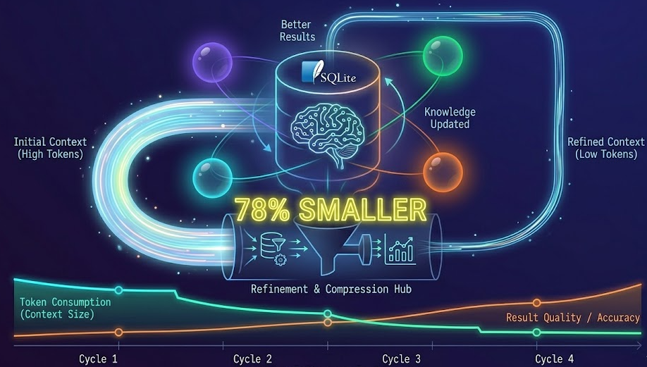
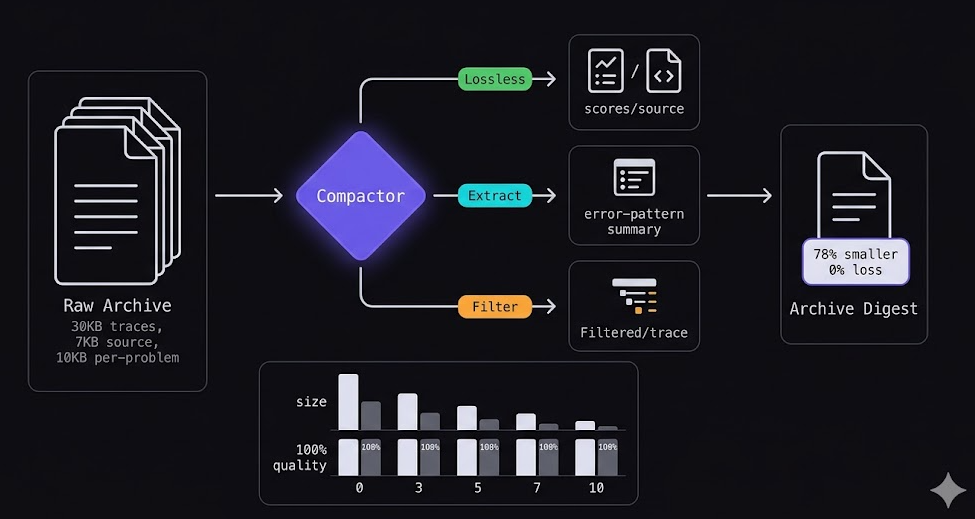

# KAOS v0.4: your agents remember now, and they use 46% less context doing it

<!-- HERO IMAGE — Generate with this prompt:

Wide 16:9 dark-themed tech illustration. Center composition:
A glowing SQLite cylinder with a brain-like neural pattern overlaid,
connected by luminous threads to 3-4 translucent agent bubbles orbiting it.
Each bubble has a different colored glow (purple, cyan, green, orange).
From the brain pattern, arrows flow downward into a funnel/compressor
that outputs a smaller, brighter, concentrated dot — representing
compressed context. Next to the funnel: a small "46% smaller" label
in monospace font. Below: a timeline showing 3 search iterations
with a knowledge line connecting them (not resetting to zero).
Color palette: deep navy (#0a0a0f), purple (#6c5ce7), cyan (#18ffff),
green (#00e676), orange (#f97316). No text except the label, no faces,
no robots. Style: abstract, clean, developer-focused infrastructure.

-->



*we fixed the proposer timeout problem, made knowledge compound across searches, and built a compactor that saves 46% context with zero quality loss. here's what happened and why it matters.*

**GitHub:** [github.com/canivel/kaos](https://github.com/canivel/kaos) | **Website:** [canivel.github.io/kaos](https://canivel.github.io/kaos) | **License:** Apache 2.0 | Free and open source

---

## the problem we had

so v0.2 shipped Meta-Harness and it worked. the proposer took accuracy from 0% to 100% in two iterations on our text_classify benchmark, inventing a domain-keyword classifier from scratch. no LLM calls, just pure Python. pretty cool.

but then it kept dying hahaha

every search past iteration 2 would timeout. the proposer makes 5-10 tool calls per iteration — list the archive, read 3 traces, read 2 source files, grep for patterns, submit a harness. each tool call goes through `claude --print`, which replays the ENTIRE conversation as input. by turn 6 the prompt is enormous and boom, timeout.

we tried raising the timeout from 300s to 600s. then 900s. didnt help. the problem wasnt the timeout — it was the architecture. we were feeding the proposer raw data and making it forage through the archive one tool call at a time. every tool call made the next one slower.

---

## smart context compaction

instead of letting the proposer explore the archive with tool calls, we pre-digest the entire archive and inject it into the prompt. one read instead of ten.

but "pre-digest" doesnt mean "truncate." truncation is lossy in an uncontrolled way — you drop the tail and have no idea if the tail was the most important part. we built a structured compactor with three strategies:

<!-- COMPACTION DIAGRAM — Generate with this prompt:

Horizontal flow diagram on dark background (#0a0a0f). 16:9 ratio.
LEFT: A tall stack of document icons labeled "Raw Archive" with sizes
"30KB traces, 7KB source, 10KB per-problem" in small monospace text.
An arrow flows right through a diamond-shaped "Compactor" node glowing
purple (#6c5ce7).
The compactor has 3 small labels branching from it:
  - "Lossless" (green, pointing to scores/source icons)
  - "Extract" (cyan, pointing to an error-pattern summary icon)
  - "Filter" (orange, pointing to a filtered/smaller trace icon)
RIGHT: A compact document icon labeled "Archive Digest" that's visually
~half the size of the left stack. A badge reads "46% smaller, 0% loss".
Below the flow: a bar chart showing 5 levels (0,3,5,7,10) with
decreasing bar heights for size and all bars at the same height for
quality (100%). Style: clean, minimal, rounded boxes.

-->



**lossless** — scores and source code stay exactly as-is. small data, 100% signal. the proposer needs exact numbers and full code.

**structured extraction** — raw traces and per-problem results get converted to error patterns. instead of 8 verbose trace entries you get "3/8 wrong: science→technology (2x), timeout (1x)". this is actually MORE useful than the raw data because it surfaces the patterns explicitly.

**filtered** — correct-problem traces get dropped entirely. they add noise, not signal. only errors and failures kept.

**conversation compaction** — for the CCR agent loop, tool results older than 6 turns get compressed to `[tool result: N chars]`. recent turns kept verbatim.

### the results

we tested with 6 diagnostic questions — the specific facts a proposer needs to make good decisions:

- Q1: which harness scored best?
- Q2: what approach works?
- Q3: why did the seeds fail?
- Q4: why did the LLM caller fail?
- Q5: whats the best cost?
- Q6: is the winning source code readable?

```
Level  0 │ 5292 chars ( 22% saved) │ 6/6 answerable │ 100% quality
Level  3 │ 3672 chars ( 46% saved) │ 6/6 answerable │ 100% quality
Level  5 │ 3672 chars ( 46% saved) │ 6/6 answerable │ 100% quality  ← default
Level  7 │ 3024 chars ( 56% saved) │ 6/6 answerable │ 100% quality
Level 10 │ 2512 chars ( 63% saved) │ 6/6 answerable │ 100% quality
```

zero quality loss at any compaction level. the proposer can answer all 6 diagnostic questions whether you compress 22% or 63%. the savings come from dropping data that has no diagnostic value — correct-problem traces, verbose per-problem output, duplicate formatting.

the key insight: structured extraction is actually BETTER than raw data for the proposer. it surfaces patterns that would take the LLM several reads to figure out from raw JSON.

you can tune it in `kaos.yaml`:

```yaml
search:
  compaction_level: 5  # 0 (no compaction) to 10 (maximum)
```

level 0 if you want the proposer to see everything. level 10 if youre running on a model with a small context window.

---

## knowledge that compounds

this was the other big gap. every `mh search` started from scratch. the proposer had zero memory of prior searches. it would discover "TF-IDF + keyword matching beats zero-shot by 100%" and then that finding would die when the search completed. next search? starts over from seed harnesses, re-discovers the same thing.

i was reading [karpathy's LLM wiki pattern](https://gist.github.com/karpathy/442a6bf555914893e9891c11519de94f) and it clicked — "the tedious part of maintaining a knowledge base is not the reading or the thinking — its the bookkeeping." LLMs dont get bored maintaining cross-references.

<!-- KNOWLEDGE COMPOUNDING — Generate with this prompt:

Vertical flow diagram on dark background (#0a0a0f). 16:9 ratio.
3 horizontal "search" lanes stacked vertically, connected by a
vertical glowing line on the left (the knowledge thread).

Lane 1 "Search 1": starts with 3 grey seed icons → arrow → proposer
icon → arrow → green star icon labeled "keyword classifier 100%".
Arrow goes down to the knowledge line.

Lane 2 "Search 2": starts with the green star icon (loaded from
knowledge line!) → arrow → proposer → arrow → cyan star "TF-IDF
variant, 30% faster". Arrow goes down to knowledge line.

Lane 3 "Search 3": starts with BOTH green and cyan stars (loaded
from knowledge) → arrow → proposer → arrow → orange star "edge
case specialist".

On the left, the vertical knowledge line is labeled "kaos-knowledge
agent" with a SQLite icon at the bottom.

Style: clean timeline, thin glowing connections, dark background.

-->


### how it works

when a search completes, KAOS files the results to a persistent "kaos-knowledge" agent:

```
/discoveries/text_classify/
    frontier.json           # pareto-optimal harnesses
    latest_search.json      # summary: best scores, iterations
    harnesses/
        keyword_class.py    # the actual winning source code
        few_shot_v2.py      # second-best approach
```

when a new search starts, KAOS loads prior discoveries as seeds instead of the default zero-shot/few-shot/retrieval seeds.

search 1: seeds are generic → proposer invents keyword classifier → 100% accuracy

search 2: seeds loaded from knowledge = keyword classifier (100%) → proposer starts from 100% and explores cost optimization

search 3: seeds = both prior winners → proposer focuses on edge cases

each search builds on the last. the bookkeeping is automatic.

```bash
kaos mh knowledge       # view whats in the knowledge base
kaos search "TF-IDF"    # full-text search across all agents
kaos index <agent-id>   # build navigable /index.md
kaos mh lint <id>       # health-check a search archive
```

---

## CLI-first architecture

btw this was the biggest architectural shift in v0.3. there was this [article about CLIs vs MCP for AI agents](https://medium.com/@unicodeveloper/10-must-have-clis-for-your-ai-agents-in-2026-51ba0d0881df) that showed CLI is 10-32x cheaper on tokens than MCP, with ~100% reliability vs MCP's 72%.

makes sense — MCP injects the entire tool schema into every context window. CLI just runs a command and gets the output.

so now every KAOS command supports `--json`:

```bash
kaos --json ls
kaos --json mh status <search-id>
kaos --json search "keyword"
kaos --json mh knowledge | jq '.benchmarks[].harnesses_stored'
```

auto-enabled when piped. an agent calling `kaos --json ls` gets clean JSON; a human calling `kaos ls` gets a Rich table.

### background worker

the MCP server used to run searches as asyncio tasks in the same event loop. if the MCP connection dropped, the search died.

now `mh_search` spawns a detached worker subprocess:

```bash
kaos mh search -b text_classify -n 10 --background
# → "Worker launched (PID 12345). Log: kaos-worker-1712345678.log"
```

survives parent exit, MCP disconnection, terminal close. logs to a file (not /dev/null — that was a fun bug to find hahaha, worker kept dying from missing numpy and we had no output to debug it).

---

## KAOS eating its own dogfood

<!-- SELF-TRIAGE — Generate with this prompt:

Square illustration on dark background (#0a0a0f).
Center: a circular Ouroboros-like shape made of code/terminal text,
representing KAOS evaluating itself. Inside the circle: a small
SQLite cylinder with a magnifying glass over it.
Around the outside: 14 small issue/ticket icons, 6 of them with
green checkmarks, 8 with grey dots. A scoreboard/leaderboard
floating next to the circle shows:
  "#15 score=6.0 ✓"
  "#13 score=4.5 ✓"
  "#12 score=4.5 ✓"
The overall feeling: self-referential, recursive, meta.
Color palette: dark navy background, purple accents, green checkmarks.
Style: minimal, abstract, no faces.

-->


we used KAOS to evaluate its own issues. spawned a `self-triage-v030` agent, ingested all 14 GitHub issues into its VFS, scored each on impact/effort/feasibility, and implemented the top 6 in priority order.

```python
afs = Kaos('kaos.db')
triage_id = afs.spawn('self-triage-v030')

# ingest all issues
for issue in github_issues:
    afs.write(triage_id, f'/issues/{issue["number"]}/issue.json',
              json.dumps(issue).encode())
    afs.set_state(triage_id, f'score.{issue["number"]}', {
        "impact": 9, "effort": 2, "feasibility": 10,
        "priority_score": 4.5,
    })

afs.checkpoint(triage_id, label='triage-complete')
```

then queried with SQL to get the ranking:

```sql
SELECT key, json_extract(value, '$.priority_score') as score
FROM state WHERE key LIKE 'score.%'
ORDER BY score DESC
```

13 issues closed across v0.3.0, v0.3.1, and v0.4.0. the framework triaged itself. for sure the most meta thing ive built.

---

## bug fixes worth mentioning

**windows unicode crash** — `sys.stdout.reconfigure(encoding="utf-8")` at CLI startup. no more `UnicodeEncodeError` on non-ASCII output.

**MCP stdout corruption** — `sys.stdout = sys.stderr` in stdio mode. any library logging to stdout no longer corrupts the JSON-RPC protocol.

**parallel spawn contention** — `spawn()` retries on WAL lock with backoff. `PRAGMA wal_autocheckpoint=100` keeps WAL small.

**evaluator bugs** — `_truncate()` was creating invalid JSON by slicing mid-string. error score keys had `+`/`-` prefixes that didnt match success keys. both caused every harness to score 0%. ouch.

**objectives override** — `SearchConfig.objectives` now defaults to `None` (inherit from benchmark) instead of hardcoding `["+accuracy", "-context_cost"]`. this was breaking every custom benchmark.

**seed harnesses never called LLM** — the seeds returned `{"prompt": ...}` with no `"prediction"` key. guaranteed 0% accuracy. now they call `llm()` (injected by the evaluator) and actually predict.

---

## whats next

the one remaining P0: **Claude Code as a full execution backend**. right now `agent_spawn` creates an isolated VFS but cant actually run an agent with real tools (Bash, web search, file read). the `ClaudeCodeProvider` does single-shot `claude --print` — useful for the proposer, but not for autonomous agents.

the vision: `agent_spawn` delegates to Claude Code as a subprocess. the spawned agent gets its own VFS, its own tool set, and its results flow back into KAOS. the entire research loop — propose, evaluate, score, checkpoint, iterate — runs inside KAOS autonomously.

thats v0.5.

---

## upgrading

```bash
git pull origin main
uv sync
kaos --version  # 0.4.0
```

existing configs and databases work unchanged. MCP server needs a restart.

---

## full changelog

**v0.4.0** (April 6, 2026)
- cross-search memory via persistent knowledge agent
- smart context compaction (0-10, 46-63% savings, 0% quality loss)
- full-text search across VFS contents
- VFS auto-index, lint, persistent skills
- 157 tests (38 new compaction tests)

**v0.3.1** (April 5, 2026)
- bug fixes: Unicode crash, WAL contention, output truncation, stdout corruption
- new: `kaos read`, `kaos logs`, `mh search --dry-run`

**v0.3.0** (April 4, 2026)
- CLI-first architecture with `--json` output
- background worker subprocess for `mh search`
- `provider: claude_code` (no API key needed)
- pluggable `llm()` callable for harnesses
- fail-fast retries, proposer timeout handling

**GitHub:** [github.com/canivel/kaos](https://github.com/canivel/kaos) — 157 tests, Apache 2.0, zero AI SDK dependencies.
